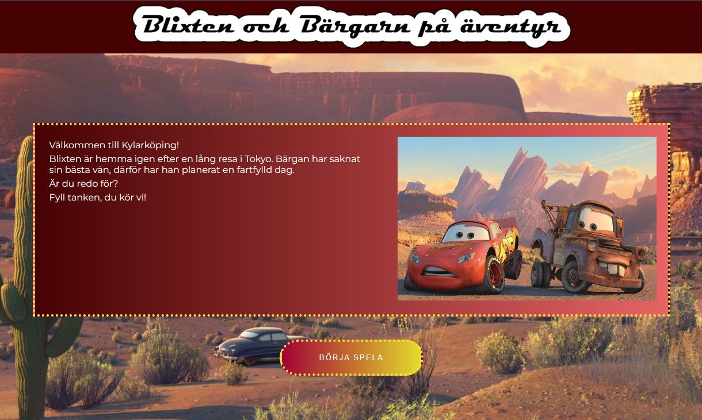
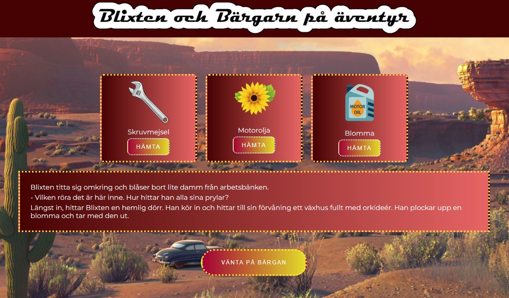

# CarAdventureGame - JavaScript Grundkurs

### I denna uppgift ska vi skapa en interaktiv upplevelse för användaren där användaren ska kunna göra förändringar (välja olika) världar/alternativ.

### Jag har använt mig av två karraktärer från filmen Bilar, här får man följa med på ett äventyr. Det finns oftast två val att välja i respektiva scen.

### Länk till min demo hittar du här:

## I projektet finns:

- images: Mapp för alla bilder
- index.html: Jag har valt att hålla denna fil tom och manipulerar hela dom:en och skapar element i min main.js
- main.js: Här ligger alla funktioner och element som skapas
- style.css: All css ligger här som är kopplad till main.js
- scenes.js: Detta är min "datafil" där alla scener är definierade
- movie.mov: Ett filmklipp som visas i en av scenerna som ska visuallisera en biostund.

- I scen 9 finns det ett "inventory" där användaren ska hämta en blomma. Detta är kopplat till localStorage.
  

## Övrigt

- https://fontmeme.com/cars-font/ - För att skapa bilden som min titel har.

- https://fonts.google.com/ - För att hämta hem min font
- https://www.remove.bg/ - För att skapa mina png-bilder
